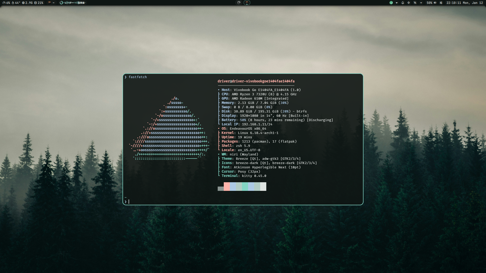
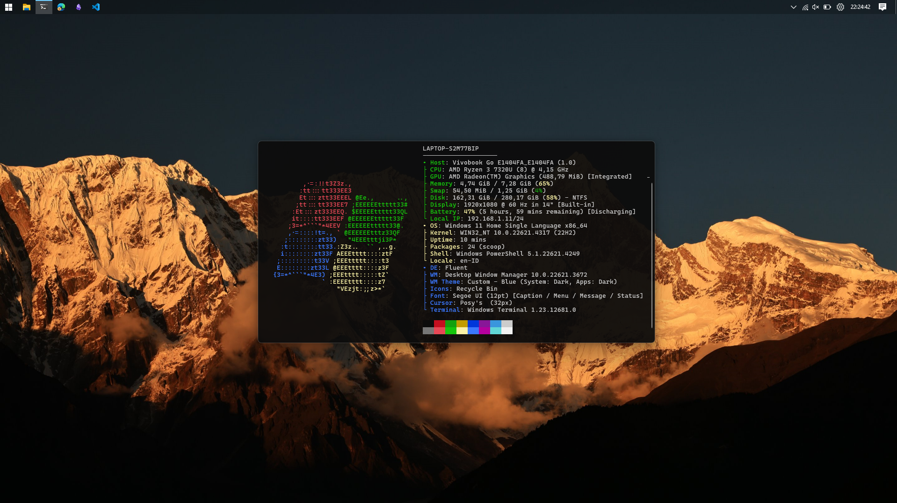

# dotfiles
My personal configuration file and list of software I use in case my system borked or I got dementia.

## Linux

I mainly run [EndeavourOS](https://endeavouros.com/) with [niri](https://github.com/YaLTeR/niri) and [noctalia-shell](https://github.com/noctalia-dev/noctalia-shell) as my primary setup. I keep [KDE Plasma](https://kde.org/plasma-desktop/) installed as a backup environment.

### Software I use
- Application launcher: [Vicinae](https://github.com/vicinaehq/vicinae)
- Polkit: [polkit-kde-agent](https://archlinux.org/packages/extra/x86_64/polkit-kde-agent/)
- Theme & Stuff:
    - [Atkinson Hyperlegible Next](https://aur.archlinux.org/packages/otf-atkinson-hyperlegible-next) + [JetBrains Mono Nerd](https://archlinux.org/packages/extra/any/ttf-jetbrains-mono-nerd/) + [FiraCode Nerd](https://archlinux.org/packages/extra/any/ttf-firacode-nerd/) - fonts
    - [Posy Cursor (Linux)](https://github.com/simtrami/posy-improved-cursor-linux) - cursor
    - [qt6ct-kde](https://aur.archlinux.org/packages/qt6ct-kde) - for qt6ct + patched to work with Dolpin and other KDE apps.
    - [nwg-look](https://github.com/nwg-piotr/nwg-look) - for GTK
- Apps
    - [Clock (KDE)](https://flathub.org/en/apps/org.kde.kclock) - timer app
    - [Dolphin](https://apps.kde.org/dolphin/) - file manager
    - [Flatseal](https://flathub.org/en/apps/com.github.tchx84.Flatseal) - manage flatpak softwares
    - [Gradia](https://flathub.org/en/apps/be.alexandervanhee.gradia) - image/screenshot editing
    - [Gwenview](https://apps.kde.org/gwenview/) - image viewer
    - [Meld](https://flathub.org/en/apps/org.gnome.meld) - visual diff tool
    - [Obsidian](https://flathub.org/en/apps/md.obsidian.Obsidian) - note taking with markdown
    - [OBS Studio](https://github.com/obsproject/obs-studio) - video recording
    - [ONLYOFFICE](https://flathub.org/en/apps/org.onlyoffice.desktopeditors) - office suite
    - [Kitty](https://github.com/kovidgoyal/kitty) - terminal emulator
    - [PCSX2](https://flathub.org/en/apps/net.pcsx2.PCSX2) - playstation 2 emulator
    - [PDF Tricks](https://flathub.org/en/apps/com.github.muriloventuroso.pdftricks) - pdf operation
    - [QDirStat](https://github.com/shundhammer/qdirstat) - disk space analyzer
    - [Ventoy](https://github.com/ventoy/Ventoy) - creating bootable USB drive
    - [Vesktop](https://github.com/Vencord/Vesktop) - discord client
    - [Visual Studio Code](https://code.visualstudio.com/) - text editor
    - [VLC](https://github.com/videolan/vlc) - media player
- CLI
    - [btop](https://github.com/aristocratos/btop) - system monitor
    - [fastfetch](https://github.com/fastfetch-cli/fastfetch) - the thing
    - [Github CLI](https://github.com/cli/cli) - github auth for git
    - [mpv](https://github.com/mpv-player/mpv) - media player (again)
    - [msedit](https://github.com/microsoft/edit) - text editor
    - [neovim](https://github.com/neovim/neovim) - text editor
    - [zoxide](https://github.com/ajeetdsouza/zoxide) - `cd` alternative

## Windows

I dual boot Linux and Windows 11 (Windows originally preinstalled). I only use it for Windows specific tasks, since my hardware can't handle running it in a VM. The specific apps I use don't really matter because they're mostly the same as on Linux, so here's just a list of things I found to make Windows 11 tolerable (subjective).

### Windows specific software I use
- [AltSnap](https://github.com/RamonUnch/AltSnap) - move window anywhere (not just titlebar) by holding alt key
- [BCUninstaller](https://github.com/Klocman/Bulk-Crap-Uninstaller) - uninstall software
- [ExplorerPatcher](https://github.com/valinet/ExplorerPatcher) - bring back Windows 10 taskbar, context menu, etc (not sure if this still work in newer version)
- [PowerToys](https://github.com/microsoft/PowerToys) - application launcher, color picker, text extractor, and more goodies in one app
- [Open Shell](https://github.com/Open-Shell/Open-Shell-Menu) - alternative start menu
- [scoop](https://scoop.sh/) - *better* Windows package manager (I use this for CLI app)
- [WinDirStat](https://windirstat.net/) (OSS) / [WizTree](https://diskanalyzer.com/) (Proprietary) - disk space analyzer
- [WindHawk](https://windhawk.net/) - Windows 11 customization tool
    - [Disable Virtual Desktop Transition](https://windhawk.net/mods/disable-virtual-desktop-transition) - disable the annoying animation during virtual desktop switch without having to disable global animation (tested on 22h2, yup I use very outdated version of Windows 11)
- [WinGet](https://github.com/microsoft/winget-cli) - default Windows package manager (I use this for GUI app)

## Synchronization
I use [Syncthing](https://syncthing.net/) to Sync my files, such as Obsidian Vault, between devices and OS I use.

### Linux
I use [Syncthing Tray](https://github.com/Martchus/syncthingtray) for system tray integration (also Dolphin and KDE) and I run [Syncthing](https://archlinux.org/packages/extra/x86_64/syncthing/) separately as a service.

### Windows
I use [SyncTrayzor v2](https://github.com/GermanCoding/SyncTrayzor). It handles both Syncthing itself and the system tray integration automatically, so you don’t need to install Syncthing separately (there might be an option to do that, but I’m not sure).

### Android
I use [Syncthing Fork](https://github.com/researchxxl/syncthing-android)
